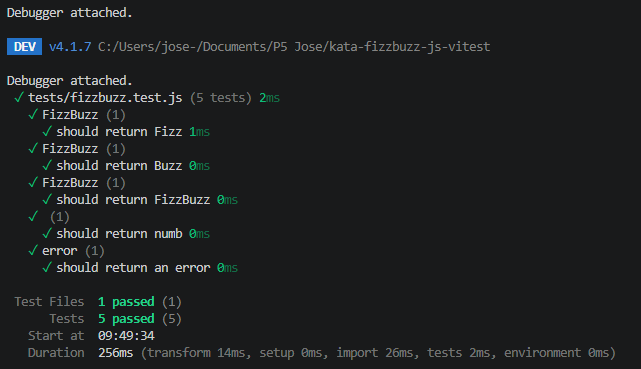

# JavaScript Exercises

En este repositorio guardaré todos los mini ejercicios de JavaScript que vaya realizando durante la formación.

## FizzBuzz Kata

Para esta kata me centré primero en entender conceptos básicos como cómo testear, el funcionamiento de JavaScript básico y funciones sencillas.

Después, fui poco a poco probando los tests. Primero el del número divisible entre tres, más tarde con el del cinco y finalmente el de ambos y el de ninguno. Para el tercer caso me encontré con un problema: el número quince, por ejemplo, me salía como solo divisible entre tres. Una vez encontré el problema y lo solucioné, las últimas situaciones fueron mucho más sencillas.

### Tests:

