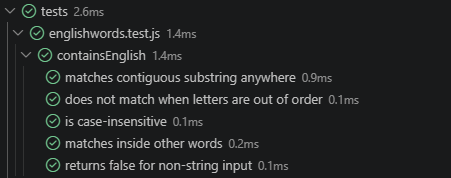

# JavaScript Exercises

En este repositorio guardaré todos los mini ejercicios de JavaScript que vaya realizando durante la formación.

## FizzBuzz Kata

Para esta kata me centré primero en entender conceptos básicos como cómo testear, el funcionamiento de JavaScript básico y funciones sencillas.

Después, fui poco a poco probando los tests. Primero el del número divisible entre tres, más tarde con el del cinco y finalmente el de ambos y el de ninguno. Para el tercer caso me encontré con un problema: el número quince, por ejemplo, me salía como solo divisible entre tres. Una vez encontré el problema y lo solucioné, las últimas situaciones fueron mucho más sencillas.

### Tests:

## The word exists or not

- En primer lugar me he centrado en encontrar una función que me vaya a ayudar en esto. Para mi función usé `'function containsEnglish(str)'`, con la que quería asegurarme que el valor de `str` retornara una cadena string (`if (typeof str = !== 'string') return false`).

- A continuación añadí la expresión `/English/i` que permite asegurarnos de que está buscando la secuencia de caracteres `'E', 'n', 'g', 'l', 'i', 's', 'h'` a la vez que hacerla insensible a mayúsculas con `i`, que es un modificador de la expresión regular anteriormente mencionada, cuya propiedad correspondiente es `ignoreCase`.

- Finalmente, los tests se realizaron en base de todos los escenarios proporcionados:

| Escenario | Test |
|---|---|
| **El orden de los caracteres importa** | `matches contiguous substring anywhere`/`does not match when letters are out of order` |
| **No importa si son mayúsculas o minúsculas** | `is case-insensitive` |
| **Valor de retorno** | `matches inside other words`/`returns false for non-string input` |

### Tests:

