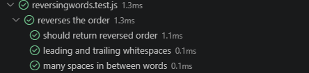

# JavaScript Exercises

En este repositorio guardaré todos los mini ejercicios de JavaScript que vaya realizando durante la formación.

## :pencil2:FizzBuzz Kata

Para esta kata me centré primero en entender conceptos básicos como cómo testear, el funcionamiento de JavaScript básico y funciones sencillas.

Después, fui poco a poco probando los tests. Primero el del número divisible entre tres, más tarde con el del cinco y finalmente el de ambos y el de ninguno. Para el tercer caso me encontré con un problema: el número quince, por ejemplo, me salía como solo divisible entre tres. Una vez encontré el problema y lo solucioné, las últimas situaciones fueron mucho más sencillas.

### :mag:Tests:

## :pencil2:The word exists or not

- En primer lugar me he centrado en encontrar una función que me vaya a ayudar en esto. Para mi función usé `'function containsEnglish(str)'`, con la que quería asegurarme que el valor de `str` retornara una cadena string (`if (typeof str = !== 'string') return false`).

- A continuación añadí la expresión `/English/i` que permite asegurarnos de que está buscando la secuencia de caracteres `'E', 'n', 'g', 'l', 'i', 's', 'h'` a la vez que hacerla insensible a mayúsculas con `i`, que es un modificador de la expresión regular anteriormente mencionada, cuya propiedad correspondiente es `ignoreCase`.

### :mag:Tests:

**Los tests se realizaron en base de todos los escenarios proporcionados:**

| Escenario | Test |
|---|---|
| **El orden de los caracteres importa** | `matches contiguous substring anywhere`/`does not match when letters are out of order` |
| **No importa si son mayúsculas o minúsculas** | `is case-insensitive` |
| **Valor de retorno** | `matches inside other words`/`returns false for non-string input` |

## :pencil2:Reversing Words

*Escribe una función que invierta el orden de las palabras en una cadena de texto proporcionada.*

- Para este ejercicio, como para los anteriores, he empezado investigando la idea de este ejercicio. ¿Invertir el orden de unas palabras en un string? Lo primero que debería hacer es *separar* esas palabras, ¿no? Ese fue mi primer planteamiento. Para ello, investigué cómo hacer esto y me encontré con el "instant method" `split()`.

- Lo siguiente a investigar era cómo revertir el orden de las palabras, ¡que no de las letras! Esto me llevó un dolor de cabeza increíble porque, aunque me topé con `reverse()`, de la forma en la que presentaba mi función (`return str.split("").reverse().join("");`) me devolvía el string dado la vuelta, sí, pero letras incluidas (`"!siht ot wen m'I ,dlrow ,olleH"`), que ni era exactamente lo que quería, ni lo que pedía el ejercicio. Investigando un poco sobre el tema, descubrí que para que devolviera lo que yo quería, debía incluir los espacios tanto en `split()` como en `join()`: `return str.split(" ").reverse().join(" ");`. De esta forma, se devolvía el string tal y como yo quería.

- En el caso de un string con espacios al principio y al final (leading and trailing) usé `trim()` (combinándolo, por supuesto, con los ya mencionados `split()` y `join()`), que se encarga de eliminar cualquier espacio en blanco.

- Finalmente, los espacios indeseados de más entre palabras, la solución fue usar `replace(/\s+/g, " ")`, un "instance method" que se encarga de reemplazar uno o más espacios (de ahí formularlo /\s+) con un solo espacio vacío (" "). Investigando, me he fijado que la /g añadida no *debería* hacer gran cosa, pero el tema es que una vez eliminada, el resultado no es exactamente el pedido.

Por último, destacar que siento que el código podría haber quedado mucho más limpio, pero no encontraba la forma de hacerlo y que funcionase, y de ahí que esté un poco emborronado.

### :mag:Tests:

**Los tests se han realizado en base a todos los escenarios propuestos:**

| Escenario | Test |
|---|---|
| **Inversión** | `should return reversed order` |
| **Limpieza de datos** | `leading and trailing whitespaces` |
| **Espacios intermedios** | `many spaces in between words` |